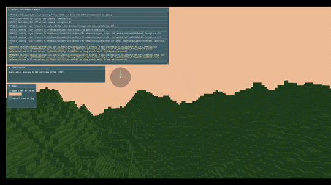
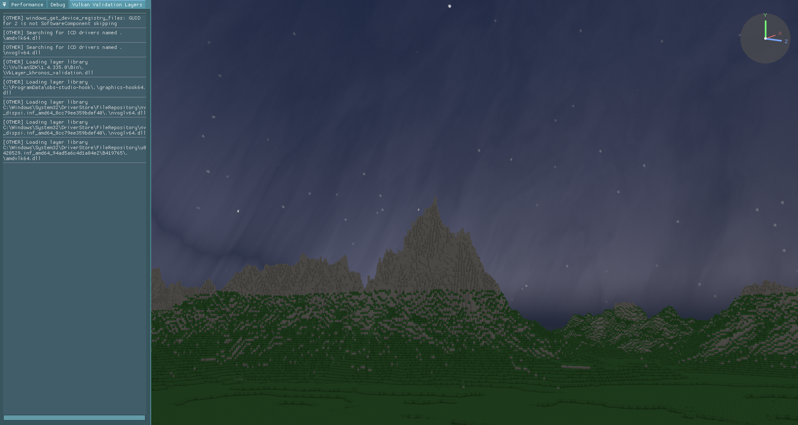

# Voxel Renderer

[](https://github.com/jswiatly/Voxel-Renderer/actions/workflows/build.yml)

A real-time renderer for procedural voxel terrain, written from scratch in **C++20** and **Vulkan 1.3**.

`C++20` · `Vulkan 1.3` · `GLFW` · `GLM` · `Dear ImGui` · `VMA`





---

## Features

**Rendering**

- Hand-written Vulkan 1.3 renderer — instance, device, swapchain, graphics pipeline, built from the ground up.
- GPU memory managed through VMA (Vulkan Memory Allocator).
- Depth buffering; mipmapped textures with anisotropic filtering; backface culling.
- Automatic swapchain recreation on resize; prefers `MAILBOX` present mode with a `FIFO` fallback.
- Directional lighting with per-face normals, driven by the sun's position in the day/night cycle.
- Skybox rendered in a dedicated pipeline, tinted by the time of day.
- Per-vertex ambient occlusion baked at meshing time.
- Distance fog (toggleable at runtime).

**Procedural terrain**

- Seeded value-noise FBM heightmap with domain warping.
- Two blended biome layers — rolling plains and mountains — mixed by a low-frequency selector noise.
- Terrain split into chunks, meshed with hidden-face removal, and culled by distance to the camera.
- Live regeneration: change the seed or world size in the UI and rebuild the world without restarting.

**Tooling / debug**

- Free-fly camera (WASD + mouse-look) with a third-person toggle.
- Dear ImGui panels:
  - **Debug** — time-of-day override, render distance, camera speed, fog toggle, seed / world size + regenerate.
  - **Performance** — frame-time graph, FPS, vertex / index / draw-call counters.
  - **3D orientation gizmo** and an in-engine viewer for Vulkan validation-layer messages.
- VMA allocation statistics dumped to JSON.

## Architecture

Single-responsibility modules behind a thin `Engine` facade (`main.cpp` is ~15 lines):

| Module             | Responsibility                                                         |
| ------------------ | ---------------------------------------------------------------------- |
| `VulkanContext`    | instance, device, queues, allocator, command pool, shared GPU helpers  |
| `Swapchain`        | swapchain, image views, depth buffer, framebuffers, resize recreation  |
| `Pipeline`         | render pass, descriptor layout, graphics pipeline, shaders             |
| `Texture`          | image upload, mipmap generation, sampler                               |
| `Mesh`             | vertex / index / uniform buffers, descriptor sets                      |
| `Renderer`         | command buffers, synchronization, draw loop, distance culling          |
| `Terrain`          | noise, heightmap, chunked mesh generation with baked AO                |
| `Skybox`           | sky dome pipeline and day/night tinting                                |
| `ImGuiLayer`       | Dear ImGui setup and debug UI                                          |
| `InputHandler`     | keyboard / mouse → camera                                              |
| `ValidationLogger` | captures Vulkan validation messages for the in-engine viewer           |

## Tech stack

| Area              | Library    |
| ----------------- | ---------- |
| Graphics API      | Vulkan 1.3 |
| Windowing / input | GLFW       |
| Math              | GLM        |
| GPU memory        | VMA        |
| UI / debug        | Dear ImGui |
| Image loading     | stb_image  |

All dependencies except the Vulkan SDK are fetched automatically by CMake — no manual setup.

## Building

Requirements:

- [Vulkan SDK](https://vulkan.lunarg.com/) (includes the `glslc` shader compiler)
- CMake 3.24+
- A C++20 compiler (MSVC, GCC/MinGW, or Clang)

```sh
git clone https://github.com/jswiatly/Voxel-Renderer.git
cd Voxel-Renderer
cmake -S . -B build -DCMAKE_BUILD_TYPE=Release
cmake --build build -j
```

On Linux, GLFW additionally needs the windowing-system headers:

```sh
sudo apt install xorg-dev libwayland-dev libxkbcommon-dev wayland-protocols
```

## Controls

| Input           | Action                     |
| --------------- | -------------------------- |
| `W` `A` `S` `D` | Move camera                |
| Mouse           | Look around                |
| `F`             | Toggle cursor capture      |
| `F5`            | Toggle third-person camera |

## Roadmap

- Renderer internals: single global UBO (replacing per-chunk uniforms), non-copyable RAII `Mesh`, deferred deletion queue.
- Multithreaded chunk meshing (generation/meshing off the render thread) with chunk streaming around the camera.
- Greedy meshing to reduce vertex counts.
- Per-chunk frustum culling.
- Shadow mapping tied to the sun direction.
- Block editing (add / remove voxels).

## License

MIT — see [LICENSE](LICENSE).
